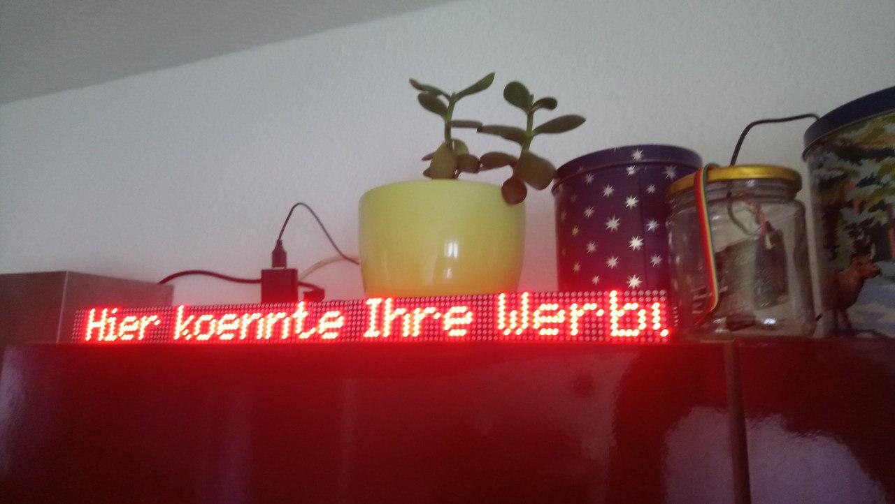
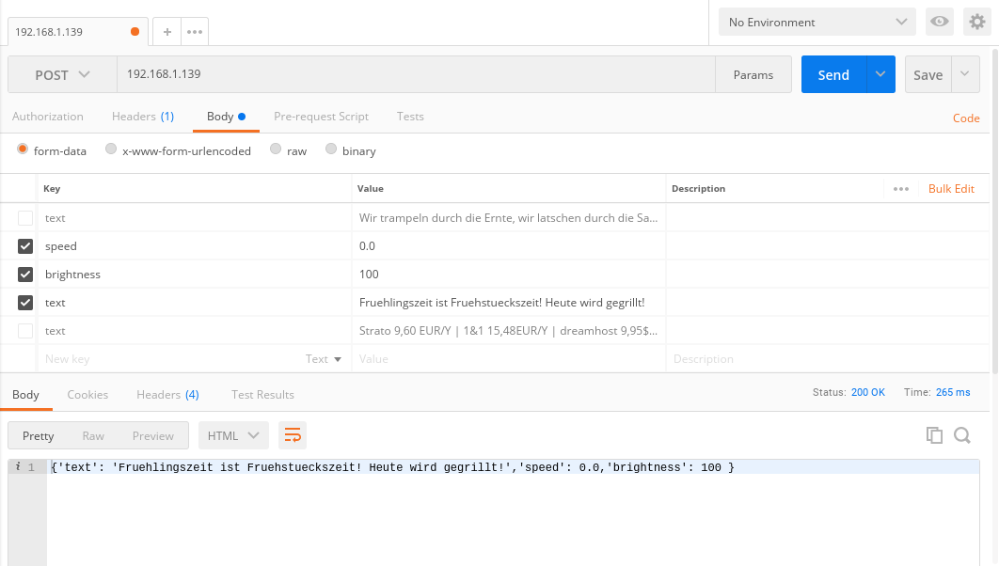

# Objective
This is a Raspberry Pi based LED Display (MAX7219) which can be controlled via http requests. It makes use of the Python libraries luma and Flask.

# GPIOs
| Board  Pin |	Name | Remarks |	RPi Pin |	RPi  Function |
|------------|------|---------|----------|---------------|
| 1 |	VCC	| +5V  Power |	2	| 5V0 |
| 2 |	GND |	Ground |	6 |	GND |
| 3 |	DIN |	Data In |	19 |	GPIO 10  (MOSI) |
| 4 |	CS	| Chip Select	| 24 |	GPIO 8  (SPI CE0) |
| 5 |	CLK	| Clock	 | 23 | GPIO 11  (SPI CLK) |

picked from [here](https://luma-led-matrix.readthedocs.io/en/latest/install.html#gpio-pin-outs)

# Installation
Don't try the installation on less hardware than a Raspberry 2. I had memory problems installing pip dependencies eg. pillow. Running the service on a Raspberry A+ works fine.  

- Activate SPI in the `raspi-config` panel.
- `sudo apt install python-pip` will install [pip](https://packaging.python.org/guides/installing-using-linux-tools/)
- `git clone https://github.com/hasenbalg/laufschriftledanzeige` will download the code to your current directory
- `cd laufschriftledanzeige` will change to the downloaded code directory
- `sudo pip install -r requirements.txt` will install all nessescery dependencies (Thats the point you might need more potent hardware).
- run the script: `sudo python laufschriftledanzeige.py --help` to see the options.
Choose the settings depending on your amount of LED panels and their orientation.
My configuration looks like this: `sudo python laufschriftledanzeige.py --cascaded 16 --block-orientation -90 --rotate 2`

## Autostart
You might want to run the script automatically on each startup of the Pi. Enter `sudo crontab -e` and add the line `@reboot sudo python laufschriftledanzeige.py --cascaded 16 --block-orientation -90 --rotate 2` with your parameters in place.

# Usage

Send POST requests to you Pi using eg. [Postman](https://www.getpostman.com/) containing the form-data *text*, *speed* and *brightness*

GET requests will be implemented

The flutter app in the PhoneApp folder can make the POST request too. 
